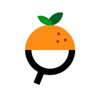
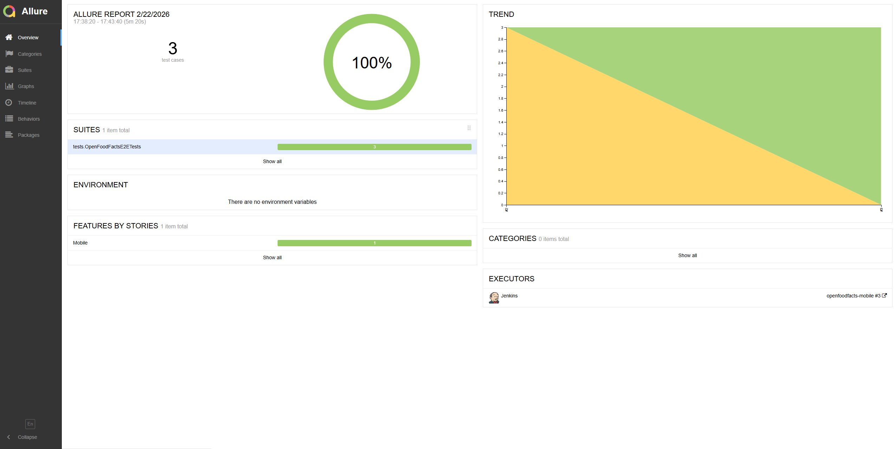
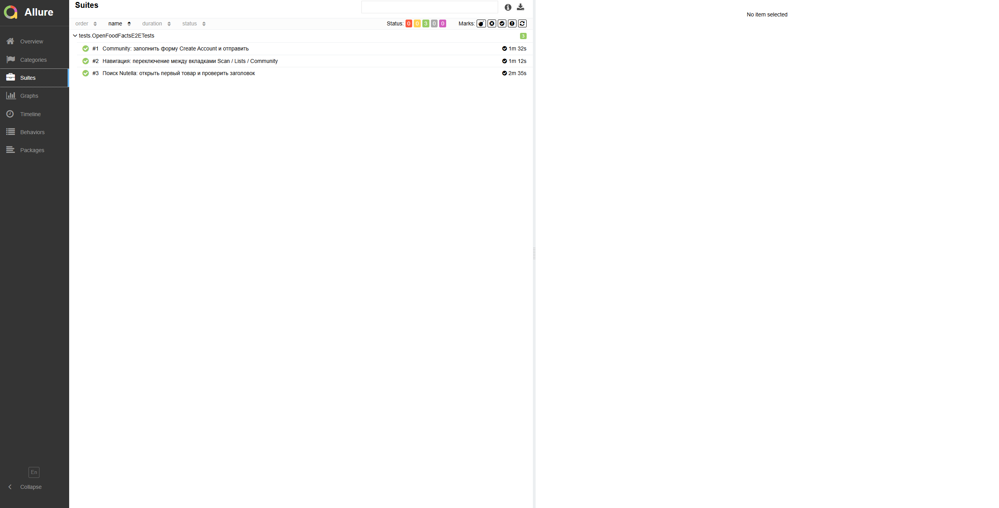
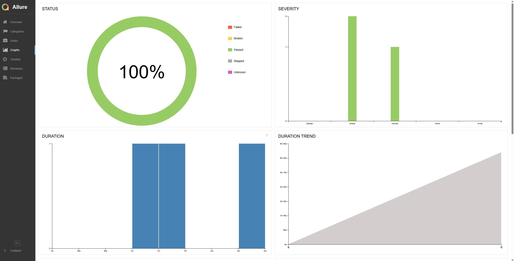

# 📱 Проект по автоматизации тестирования

<a href="https://world.openfoodfacts.org">
</a>

Тестовый проект по автоматизации **Mobile UI-тестов** для нового мобильного приложения  
**Open Food Facts (Android)**

🔹 Android (Flutter application)  
🔹 Open-source проект: https://world.openfoodfacts.org  
🔹 GitHub: https://github.com/openfoodfacts

Проект выполнен в демонстрационных и учебных целях
(построение портфолио QA Automation Engineer).
---

## 🎯 Особенности проекта

- Реализован Screen Object pattern

- Универсальная фабрика драйверов

- Поддержка Android

- Гибкая конфигурация через Owner

- CI-ready архитектура

- Полная интеграция с Allure
---

## 📌 Содержание

- [Технологии и инструменты](#tools)
- [Структура проекта](#structure)
- [Покрытые сценарии](#tests)
- [BrowserStack интеграция](#browserstack)
- [Jenkins CI](#jenkins)
- [Запуск из терминала](#run)
- [Allure отчёт](#allure)

---

<a id="tools"></a>
## 🛠 Технологии и инструменты

<p align="center"> 
  <a href="https://www.jetbrains.com/idea/"></a>
  <a href="https://www.java.com/"></a>
  <a href="https://junit.org/junit5/"></a>
  <a href="https://gradle.org/"></a>
  <a href="https://appium.io/docs/en/latest/">
  <a href="https://www.browserstack.com/">
  <a href="https://github.com/allure-framework/allure2"></a>
  <a href="https://www.jenkins.io/"></a>
  <a href="https://github.com/"></a> 
</p>

### 📱 Для мобильных UI-тестов используются:

- Язык: `Java`
- Тестовый фреймворк: `JUnit 5`
- Мобильная автоматизация: `Appium`
- Удалённый запуск устройств: `BrowserStack`
- Конфигурации: `Owner`
- Сборка: `Gradle`
- Отчётность: `Allure Report`
- CI: `Jenkins`

---

<a id="structure"></a>
## 📁 Структура проекта

```text
openfoodfacts-mobile-tests
├── build.gradle
├── settings.gradle
├── README.md
└── src
└── test
├── java
│ ├── config
│ │ ├── BrowserstackConfig.java
│ │ └── LocalConfig.java
│ │
│ ├── drivers
│ │ ├── browserstack
│ │ │ └── BrowserstackDriver.java
│ │ └── local
│ │ └── LocalDriver.java
│ │
│ ├── helpers
│ │ ├── AllureAttachments.java
│ │ ├── ApkInstaller.java
│ │ └── BrowserstackApi.java
│ │
│ ├── screens
│ │ ├── BaseScreen.java
│ │ ├── ScanScreen.java
│ │ ├── SearchProductsScreen.java
│ │ ├── ProductDetailsScreen.java
│ │ ├── CommunityScreen.java
│ │ └── CreateAccountScreen.java
│ │
│ ├── components
│ │ └── BottomNavBar.java
│ │
│ ├── tests
│ │ ├── TestBase.java
│ │ └── OpenFoodFactsE2ETests.java
│ │
│ └── utils
│ └── TextNormalizer.java
│
└── resources
├── apps
│ └── openfoodfacts.apk
└── config
├── browserstack.properties
└── local.properties
```
---
<a id="tests"></a>
## ✅ Покрытые E2E сценарии

Тесты реализованы с использованием **Page Object / Screen Object pattern** и детализированы через **Allure Steps**.

---

### 🧭 Навигация между вкладками

✔ **Переключение Scan / Lists / Community**

- открывается приложение
- проходит онбординг
- проверяется экран Scan
- выполняется переключение через Bottom Navigation
- проверяется открытие экрана Community

---

### 🔎 Поиск продукта

✔ **Поиск Nutella и открытие карточки товара**

- открывается приложение
- проходит онбординг
- открывается экран Scan
- выполняется переход к поиску
- вводится поисковый запрос `nutella`
- открывается первый результат
- проверяется корректность заголовка товара

---

### 👤 Регистрация пользователя

✔ **Заполнение формы Create Account**

- открывается приложение
- проходит онбординг
- переход в раздел Community
- открытие формы регистрации
- генерация случайного пользователя
- заполнение формы
- подтверждение регистрации
- проверка успешного результата

---

### 🏷 Allure-аннотации

Каждый тест содержит:

- `@Epic`
- `@Feature`
- `@Story`
- `@Severity`
- `@Owner`
- `@DisplayName`

Это позволяет:

- выделять critical сценарии
- анализировать стабильность сборок
- использовать отчёт как тестовую документацию

---

<a id="browserstack"></a>
## ☁️ BrowserStack интеграция

Проект поддерживает запуск:

- 📱 Android (real devices / emulators)

Загрузка приложения выполняется через API:

```bash
curl -u "USER:KEY" 
-X POST "https://api-cloud.browserstack.com/app-automate/upload" 
-F "file=@openfoodfacts.apk"
```
Результат:
```bash
{"app_url":"bs://xxxxxxxxxxxxxxxx"}
```
---

<a id="jenkins"></a>
## 🚀 Сборка в Jenkins
CI настроен для удалённого запуска мобильных тестов.

Параметры сборки:

- `deviceHost (browserstack / local)`

- `platform (android)`

- `bs.user`

- `bs.key`

- `bs.app`

- `build`

- `project`
---

## Gradle команда в Jenkins

```bash
set +x
export BROWSERSTACK_USER='YOUR_USER '
export BROWSERSTACK_KEY='YOUR_KEY'

/home/jenkins/tools/hudson.plugins.gradle.GradleInstallation/8.5/bin/gradle clean test -DdeviceHost=browserstack
```
---

## 📊 Post-build

- генерация Allure Report

- публикация отчёта

- прикрепление видео

- отправка уведомлений
---

<a id="run"></a>

## 💻 Запуск из терминала
## 📱 Android (BrowserStack)

```bash
./gradlew clean test 
-DdeviceHost=browserstack 
-Dbs.user=YOUR_USER 
-Dbs.key=YOUR_KEY
```
---
## 🖥 Локальный запуск (Appium)

```bash
.\gradlew clean test 
-DdeviceHost=local 
-Dudid=8d36d42b
```
---
После выполнения тестов формируются результаты:
```bash
build/allure-results
```
---
<a id="allure"></a>
## 📊 Allure отчёт

После сборки формируется подробный отчёт, содержащий:

- список тестов

- шаги выполнения

- параметры теста

- скриншоты

- page source

- видео BrowserStack

- графики стабильности
---
### <a href="https://jenkins.autotests.cloud/job/openfoodfacts-mobile/3/allure/#">*Основная страница отчёта*</a>



### <a href="https://jenkins.autotests.cloud/job/openfoodfacts-mobile/3/allure/#suites">*Тест-кейсы Mobile*</a>


### <a href="https://jenkins.autotests.cloud/job/openfoodfacts-mobile/3/allure/#graph">*Графики*</a>



---


## 🎥 Пример видео выполнения теста в Selenoid

Для каждого теста сохраняется видео, доступное в Allure → Suites → TestCase → Tear down →
**Attachments**.


---